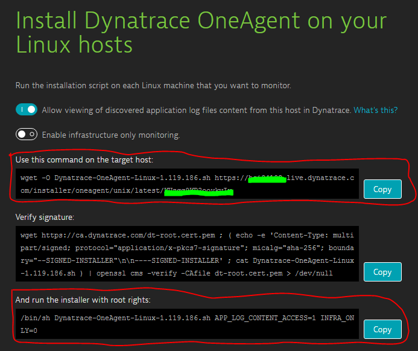
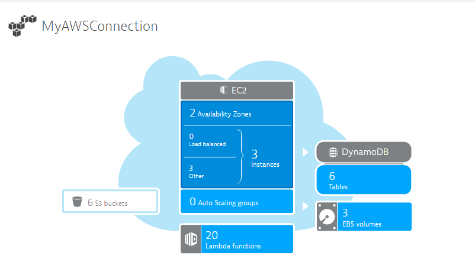
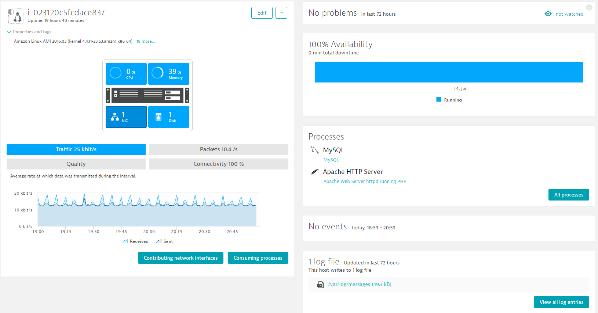
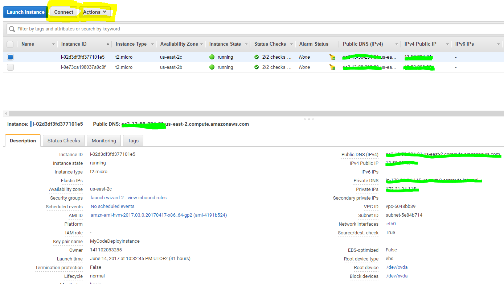
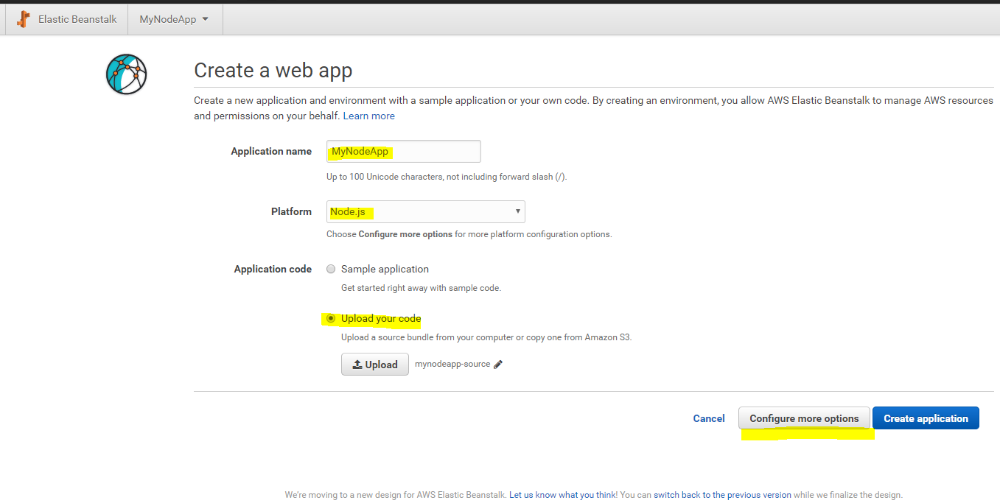
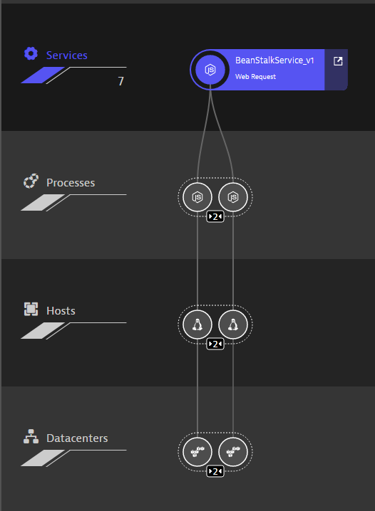
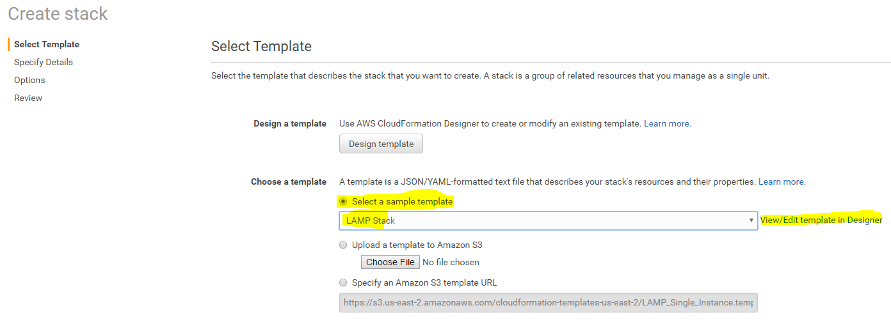
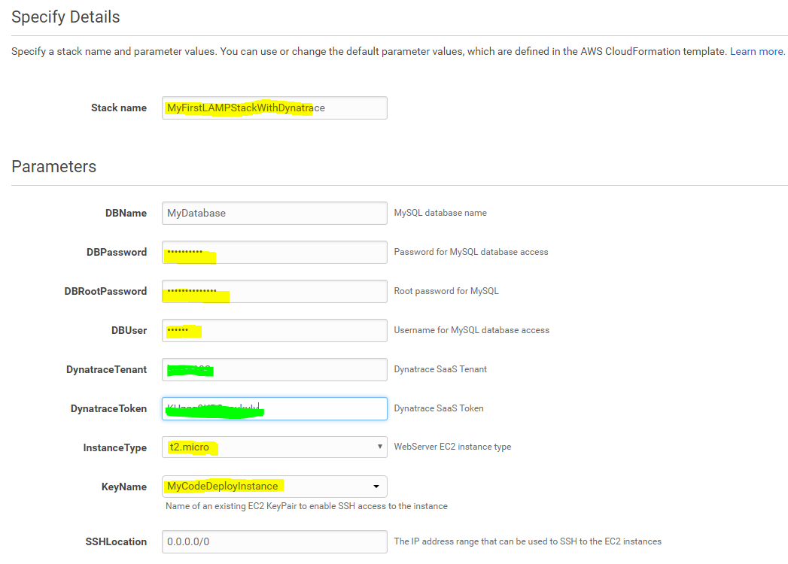
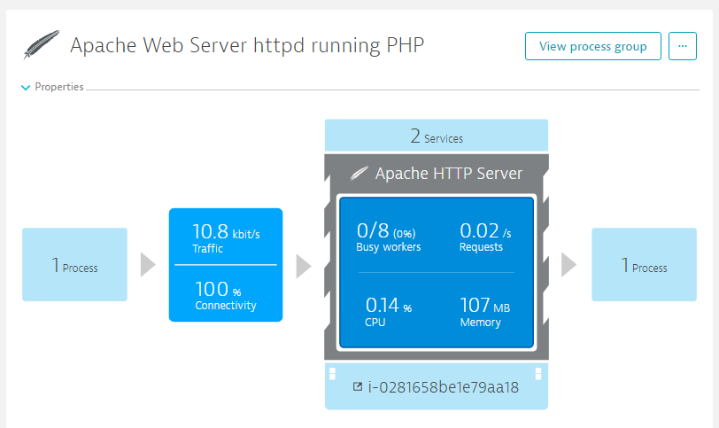
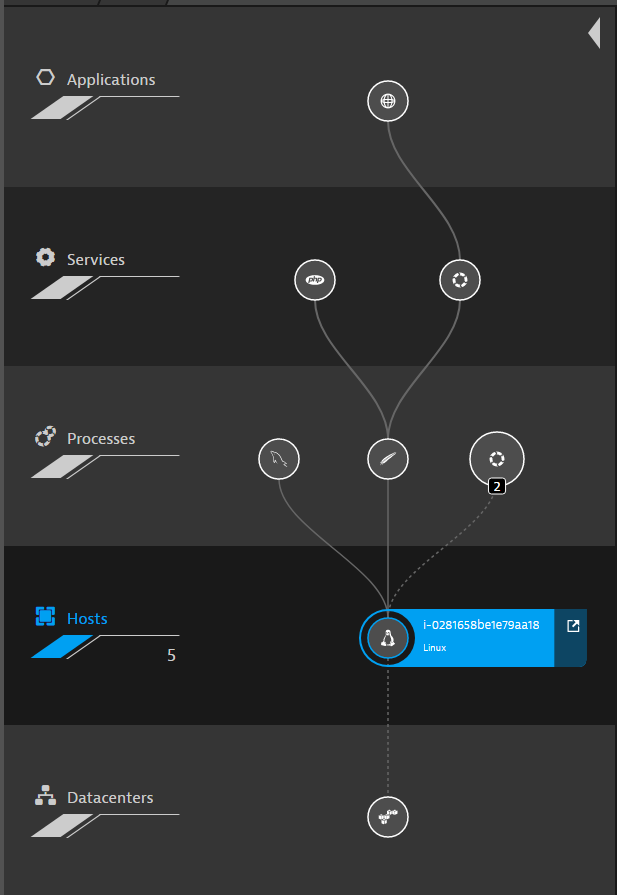

# AWS Monitoring Tutorials for Dynatrace SaaS/Managed

In this tutorial we have different labs where we learn different use cases on how to monitor applications and services on AWS with Dynatrace SaaS. The same will also work if you have Dynatrace Managed installed On-Premise. Also remember: Dynatrace can not only monitor your AWS Environments but all your Apps deployed on premise, Azure, OpenStack, OpenShift, VMWare or anywhere else!

1. [Lab 1: Setting up AWS Monitoring through Cloud Watch Integration](#lab-1-setup-dyntrace-aws-monitoring-integration)
2. [Lab 2: Monitoring EC2 Instances with Dynatrace OneAgent](#lab-2-install-oneagent-on-ec2-instance)
3. [Lab 3: Monitoring Node.JS deployed through AWS Beanstalk](#lab-3-monitor-nodejs-beanstalk-application)
4. [Lab 4: Monitoring LAMP Stack configured through CloudFormation](#lab-4-monitor-lamp-stack-configured-through-cloudformation)
4. [Lab 5: AWS Lambda Zombie Workshop with Manual RUM Injection](#lab-5-aws-lambda-zombie-workshop)

## Pre-Requisits
1. You need an AWS account. If you dont have one [get one here](https://aws.amazon.com/)
2. You need a Dynatrace Account. Get your [Free SaaS Trial here!](http://bit.ly/dtsaastrial)

## Preparation
**Amazon**
1. To remote into EC2 Instances we will need a Key Pair. Create one in preparation or once you walk through the lab
2. To learn more about Key Pairs and how to connect to EC2 Instances read [Connect to your Linux Instance](https://docs.aws.amazon.com/AWSEC2/latest/UserGuide/AccessingInstances.html) 

**Dynatrace Tenant Data**
1. In your Dynatrace SaaS Portal navigate to Deploy Dynatrace -> Start Installation -> Linux 
2. Copy the OneAgent Download and Installation command line (circled in red) as we will need it throughout the labs
3. Also make a note of your TenantID and Token (two green marks) as we will also need it later


# Lab 1 Setup Dynatrace AWS Monitoring Integration
This lab will teach us how to setup the Dynatrace AWS Monitoring Integration with AWS CloudWatch. 
The goal is to see the Dynatrace AWS Monitoring Dashboard populuated with data pulled from both [AWS CloudWatch](https://aws.amazon.com/cloudwatch/) as well as from installed OneAgents:


**Step-by-Step Guide**
1. Open [Dynatrace Doc: How do I start Amazon Web Service Monitoring](https://help.dynatrace.com/infrastructure-monitoring/amazon-web-services/how-do-i-start-amazon-web-services-monitoring/). 
2. Follow the instructions for either Role or Key-based authentication
3. Tip for Role-based: Make sure you remember the Role Name, your AWS Account ID and the External ID while creating the role. You will need it at the very last step of the configuration
4. Once done Validate that Dynatrace shows data in the AWS Dashboard. Simply click on "AWS" in the Dynatrace menu and you should see a simliar screen as shown above

**Costs:** AWS charges for CloudWatch API access when exceeding 1 million requests. More details can be found in the Dynatrace and CloudWatch Documentation

# Lab 2 Install OneAgent On EC2 Instance
This lab will teach us how to install a Dynatrace OneAgent on a Linux EC2 Instance. 
The goal is that the EC2 host will show up in Dynatrace and is fully monitored through a OneAgent


There are multiple ways to install a Dynatrace OneAgent on a "bare" EC2 Instance. If configuration management tools such as Puppet, Chef, Ansible or AWS CodeDeploy are used then Dynatrace OneAgent deployment can be done through these tools.
Another very convenient approach for EC2 is to specify startup scripts that automatically get executed whenever Amazon launches an EC2 instances. In EC2 this is called "User Data".

**Step-by-Step Guide**
1. Logon to AWS and navigate to EC2. [This link](https://us-east-2.console.aws.amazon.com/ec2/v2/home) should also get you there!
2. Now select the option to **Launch a new Instance**
3. Select **Amazon Linux AMI** and then select the free tier eligible **t2.micro** instance type. Select Next
4. **Configure Instance:** Expand the Advanced section and specify the following User Data script (make sure you use your unique OneAgent Download URI) 
```
#!/bin/bash
wget -O Dynatrace-OneAgent-Linux.sh https://YOURTENANT.live.dynatrace.com/installer/oneagent/unix/latest/YOURTOKEN
/bin/sh Dynatrace-OneAgent-Linux.sh APP_LOG_CONTENT_ACCESS=1 INFRA_ONLY=0
```
5. Click next and make yourself familiar with Storage options. We keep the defaults 
6. **Add Tags:** on this configuration screen we add a custom tag. Key=EC2InstanceType; Value=LabExcercise. 
7. Click through the rest of the steps. Review settings and click Launch
8. Select or create a new key pair. We will need this for remoting into EC2
9. You can observe the launch log
10. Navigate to the Dynatrace Hosts list and wait until the host shows up. Click on it and explore what is monitored
11. Expand the list of Properties and Tags. We should also find our EC2InstanceType tag with the value LabExcercise

Troubleshooting

If something doesnt go as expected what to do? Well - Amazon provides a good way to access these EC2 instances
1. Navigate to your [EC2 Manager Console](https://us-east-2.console.aws.amazon.com/ec2/v2/home)
2. Select the EC2 instance in question
3. Explore the options such as **Connect** and follow the instructions to remote into that machine. 
4. Explore **Actions -> Instance Settings -> Get System Log** to get access to the system log and verify what happened during startup



Useful Links
* [Running commands on your Linux Instance during Startup](http://docs.aws.amazon.com/AWSEC2/latest/UserGuide/user-data.html)
* [Running commands on your Windows Instance during Startup](http://docs.aws.amazon.com/AWSEC2/latest/WindowsGuide/UsingConfig_WinAMI.html#user-data-execution)

# Lab 3 Monitor-NodeJS-Beanstalk-Application
This lab will teach us how to install a Dynatrace OneAgent into a Node.js application deployed with AWS Beanstalk.
As a base we use the sample node.js application that AWS uses in their tutorials. For more information see ...
The goal of this lab is to have full Node.js and End User monitoring enabled with Dynatrace.

**Background Information on Beanstalk**
Beanstalk allows you to simply upload your application code as a zip or war file to AWS. AWS Beanstalk then 
1. Launches a new EC2 instance for you with the required runtime (Node.js, PHP, Java, .NET ...)
2. Extracts your ZIP/WAR file onto that machine
3. Sets Environment Variables and executes startup scripts to prepare the environment#
4. Launches the runtime environment (Node.js, PHP, Java, .NET ...)

*Installing OneAgent on Beanstalk*
One way to install a Dynatrace OneAgent on such a Beantstalk EC2 instance is to leverage the "Elastic Beanstalk Extensions" concept. Beanstalk allows you to put additonal configuraton and script instructions into a subfolder called .ebextensions. Files with the ending .config will then be analyzed and executed during the startup phase of an instance. In our example you will find the following files in the .ebextension directory:
* dynatrace.config: Defines two Environment Variables (RUXIT_TENANT, RUXIT_TOKEN). It also downloads an special beanstalk installation script (still branded ruxit.com) into a special directory that will be executed by Beanstalk as part of the instance launch process. This script references these two environment variables. The environment variables could be set with default values in the .config file or can later be defined as part of the Beanstalk Configuration when launching an instance. We will do the latter.
* version.config: This config files specifies additional environment variables that are set to the EC2 instance. It can be used to demonstrate custom process group tagging with Dynatrace

Prerequisit
1. Download the NodeJSBeanStalkSample from this GitHub Repo
2. Explore the .ebextensions directory as explained above
3. Create a ZIP file of the full NodeJSBeanStalkSample including .ebextension directory

**Step-by-Step-Guide**
1. Logon to AWS and Navigate to Elastic Beanstalk. [This link](https://us-east-2.console.aws.amazon.com/elasticbeanstalk/home) should also get you there
2. **Create a new application**
3. Give it a name. Select **Node.js** as the platform and **upload your zip** file. Then click on **Configure more options**

4. Click on Software Options and add RUXIT_TENANT and RUXIT_TOKEN with your tenant and token. Click on Save

5. Now its time to launch the environment
6. Once the environment is up and running we can access the website. It is a very simply one page website that is delivered by Node.js. Dynatrace OneAgent will automatically inject the JavaScript Tag for Real User Monitoring. You can verify that.


**Additional Step: Process Group Identification**
Dynatrace automatically detects process groups and by default does a pretty good job in detecting the logical application deployed by looking at different environment variables or application server configuration files. If you want to override that process you can configure a custom Process Group Detection Rule. In our version.config file we specify a custom environment variable called MYVERSION. In this additional step we simply configure dynatrace to detect the Process Group Name based on that value in case this environment variable is set.
1. In Dynatrace go to Settings -> Monitoring -> Process group detection
2. Add a new rule for Node.js and specify MYVERSION as the environment variable to look at
3. Next time you launch your application you will see Dynatrace will capture that value of our MYVERSION Environment Variable

**Additional Step: Load Balancing**
1. Go to your Beanstalk Environment in AWS Console
2. Click on Configuration - Scaling
3. Change the environment type to "Load balancing, auto scale"
4. Apply the changes and let Beanstalk restart
5. Go back to the same settings after restart and change auto scale to minimum instances of 2
6. Apply changes and validate that Dynatrace detects both instances

Here is what you should see if you go to Smartscape. Dynatrace shows the logical Node.js service. The name BeanStalkService_v1 is actually taken from our previously defined custom process group detection. We also see that this service runs on 2 Node.js instances on two different EC2 hosts in two Availability Zones:


Useful Links
* [What Is AWS Beanstalk](http://docs.aws.amazon.com/elasticbeanstalk/latest/dg/Welcome.html)
* [Dynatrace Blog:Set up custom process group monitoring](https://www.dynatrace.com/blog/set-custom-process-groups-monitoring/)

# Lab 4 Monitor LAMP Stack configured through CloudFormation
This lab will teach us how to use a pre-configured CloudFormation stack to configure a classical LAMP stack. We will inject the Dynatrace OneAgent into the User Data portion of the EC2 instance launch by changing the CloudFormation template. This will allow us to create multipl stacks of the same LAMP stack including Dynatrace OneAgent monitoring

**Step-by-Step-Guide**
1. Logon to AWS and navigate to the [CloudFormation Service](https://us-east-2.console.aws.amazon.com/cloudformation/home)
2. **Create a new Stack**: Select LAMP Stack and then click on *View/Edit template*

3. We are going to add two new parameters: DYNATRACE_TENANT and DYNATRACE_TOKEN which users can later provide. Simply add the following code snipped to the parameters in the JSON Editor
```
    "DynatraceTenant": {
        "Description": "Dynatrace SaaS Tenant",
        "Type": "String",
        "MinLength": "1",
        "MaxLength": "64",
        "AllowedPattern": "[a-zA-Z][a-zA-Z0-9]*",
        "ConstraintDescription": "must begin with a letter and contain only alphanumeric characters."
    },        
    "DynatraceToken": {
        "Description": "Dynatrace SaaS Token",
        "Type": "String",
        "MinLength": "1",
        "MaxLength": "64",
        "AllowedPattern": "[a-zA-Z][a-zA-Z0-9]*",
        "ConstraintDescription": "must begin with a letter and contain only alphanumeric characters."
    }, 
```
4. Now we are going to add a similar User Data startup script as we did when instrumenting a regular EC2 Instance launch. Scroll down to the "UserData" Property Definition. Right after the line "yum update -y aws-cfn-bootstrap\n" we will add the following code.:
```
            "# Install Dynatrace OneAgent\n",
            "cd /home/ec2-user\n",
            "wget -O Dynatrace-OneAgent-Linux.sh https://",
            {
                "Ref": "DynatraceTenant"
            },
            ".live.dynatrace.com/installer/oneagent/unix/latest/",
            {
                "Ref": "DynatraceToken"                                    
            },
            "\n",
            "/bin/sh Dynatrace-OneAgent-Linux.sh APP_LOG_CONTENT_ACCESS=1 INFRA_ONLY=0\n",
```
5. **Click on "Validate Template"** in the toolbar to make sure you have no typos.
6. Now we have a CloudFormation script that will launch a LAMP Stack but that will also install a Dynatrace OneAgent where DYNATRACE_TENANT and DYNATRACE_TOKEN are configurable.
7. **Click on Create Stack** in the toolbar. This will get you back to the previous screen with your new template already uploaded to S3
8. **Click on Next**
9. Now we have to fill out all the parameters - including our Dynatrace Tenant and Dynatrace Token. Please choose a good name for the stack and provide the passwords for the database properties. When done **Click Next**

10. **Options**: Here you could define additonal tags that would automatically be picked up by Dynatrace OneAgent. Feel free to define a tag and explore that option. Once done **Click Next**
11. **Review**: Review your settings - then **Click Create**
12. You will end up in the Stack List. TIP: if your Stack doesnt show up click the Refresh button! It will take a while until everything is fully created!
13. Once the environment is in status *CREATE_COMPLETE* select the entry and find the URL to your enviornment in the Output tab in the bottom. Open that URL. You will see that PHP returns its standard page.
14. **Dynatrace**: Now move over to Dynatrace and explore the data collected. If you click on Technology you should see Apache and MySQL show up. Click on Apache, expand the bottom list of process groups and click on Proces Group Details. From there you can navigate further to the actual process group and explore more about the data captured:

Navigating to the Smartscape actually shows you how Dynatrace OneAgent really automatically detects every single process on that EC2 Linux instance including MySql and some other native processes


Useful Links:
* [AWS CloudFormation documentation](https://aws.amazon.com/documentation/cloudformation/)

# Lab 5 AWS Lambda Zombie Workshop
This lab from Amazon promotes Servless technology. It is often used on AWS Servless Meetups and Hackathons.
Please follow the instructions on the [AWS Lambda Zombie Workshop GitHub Repo](https://github.com/awslabs/aws-lambda-zombie-workshop). 
For the Dynatrace lab we do not need to go through the full excercise. Just the initial deployment of the app and inintial configuration steps are sufficient to get the app up& running.

Once the application is deployed you will see that Dynatrace automatically monitors those resources used by this iapplication: DynamoDB and Lambdas
In order to enable Real User Monitoring we have to manually inject the Dynatrace JavaScript Tag because the HTML pages are static files delivered through S3.

The goal of this tutorial therefore is to see Dynatrace monitor DynamoDB, Lambda and Real User Activity.
